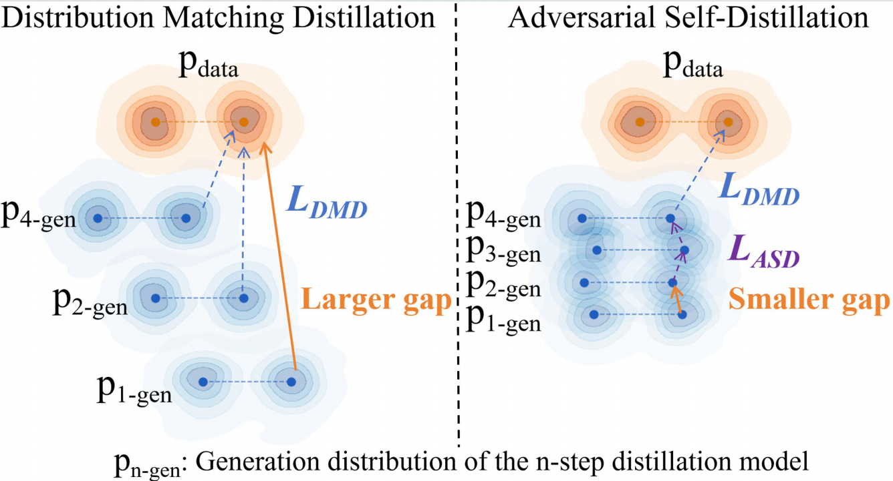
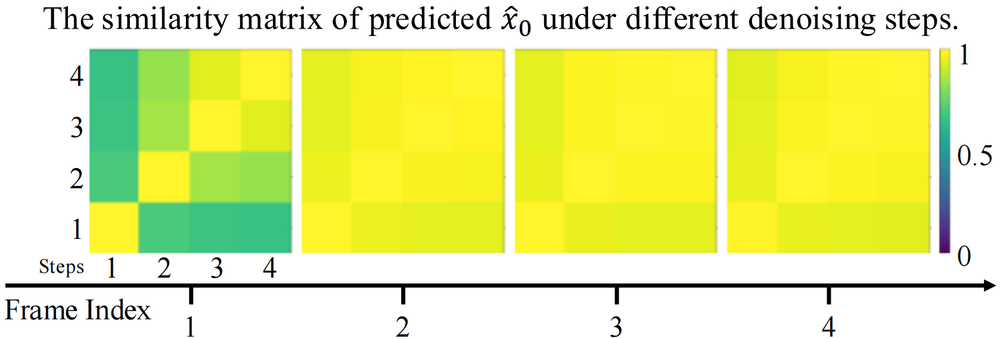
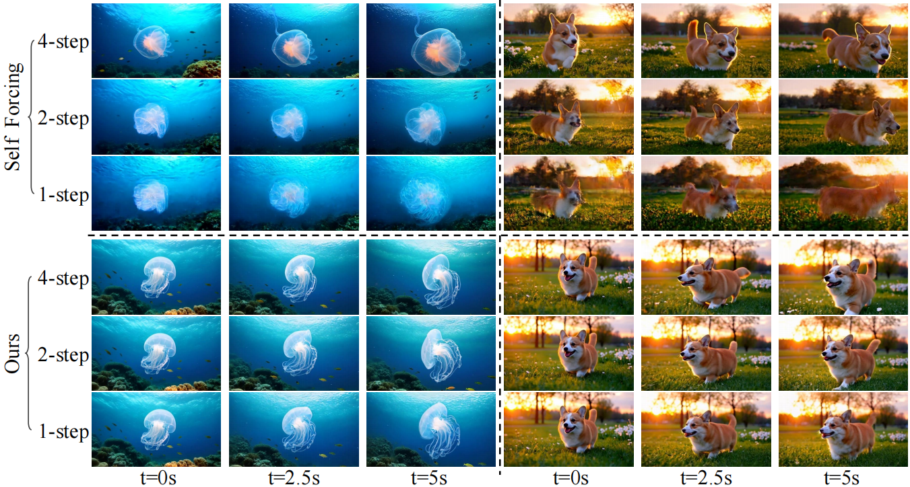
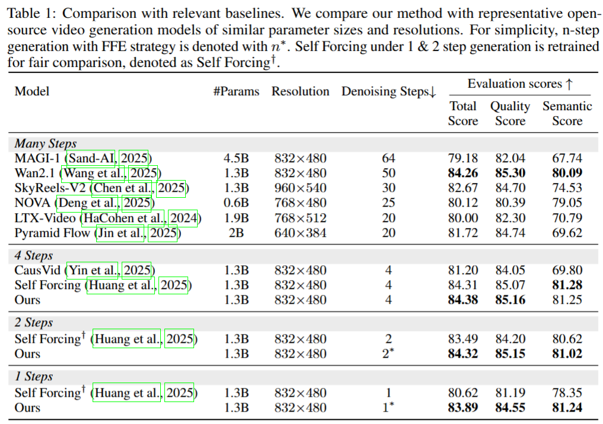
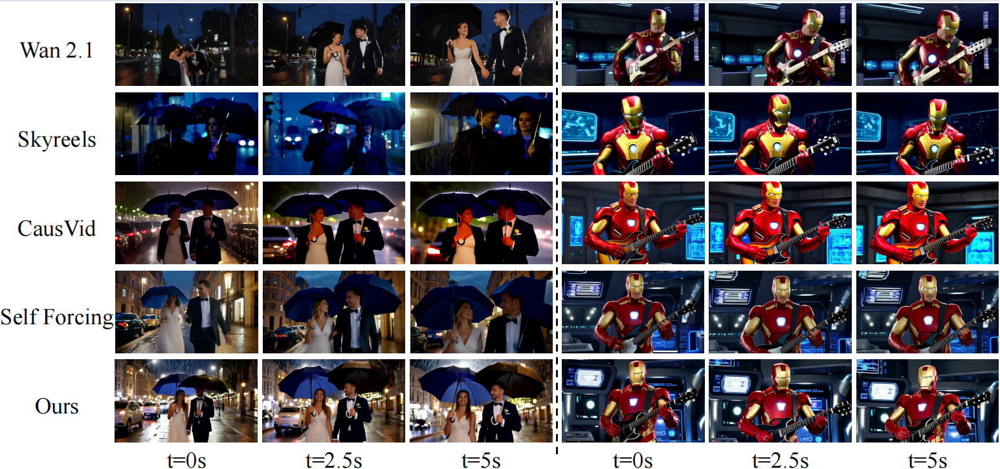
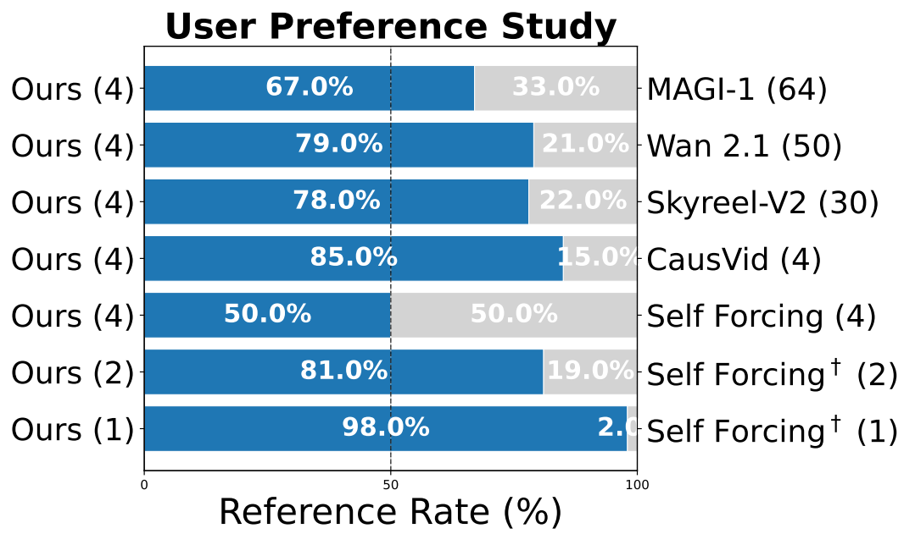
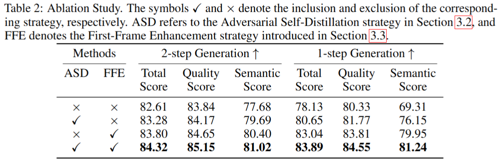
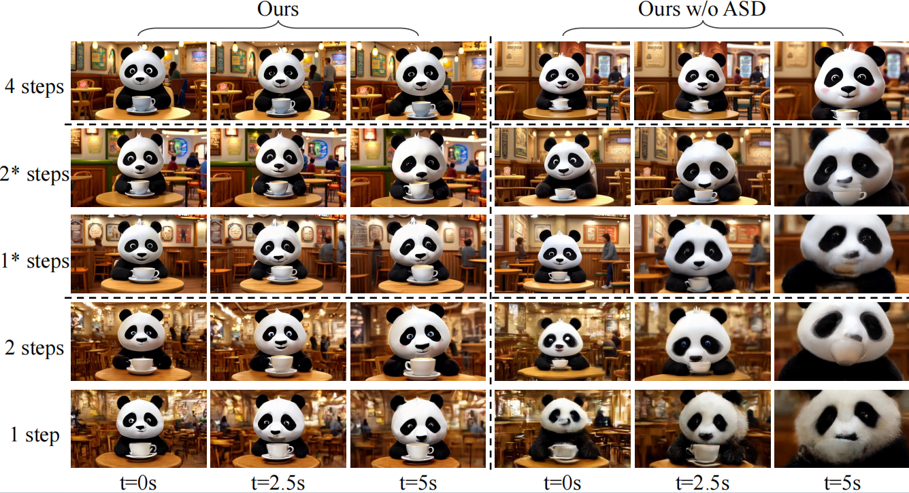

# 🎥 Towards One-Step Causal Video Generation via Adversarial Self-Distillation

<!-- [](https://arxiv.org/abs/xxxx.xxxxx) 
[](#)
[](LICENSE) -->

---

## 🌟 Overview

Traditional hybrid video generation models combine autoregressive temporal dynamics with diffusion-based spatial denoising, but their sequential, iterative nature leads to error accumulation and long inference times. **Our framework enables high-quality causal video generation with just 1-2 denoising steps** while maintaining flexibility across different inference configurations.

  
*Figure 1: Different alignment strategies of DMD and ASD during distillation. ASD bridges smaller intra-student gaps for smoother supervision.*

---

## 💡 Key Innovations

### 🔥 Adversarial Self-Distillation (ASD)
Unlike prior distillation methods that rely solely on supervision from multi-step teachers, ASD aligns the outputs of the student model's n-step denoising process with its (n+1)-step version in the distribution level. This provides:
- **Smoother supervision** by bridging smaller step-to-step gaps
- **More informative guidance** by combining teacher knowledge with locally consistent student behavior
- **Enhanced training stability** for extremely few-step generation

### ⚡ First-Frame Enhancement (FFE)
Our empirical analysis reveals that initial frames require more denoising steps to prevent error propagation, while later frames exhibit higher generative redundancy. FFE strategically allocates more denoising steps to crucial initial frames and applies larger skipping steps to subsequent frames.

  
*Figure 2: Cosine similarity matrices of differ-
ent frames in causal diffusion video generation.
Each matrix shows the similarity of the predicted
ˆx0 between different denoise steps (from 1 to 4).*

### 🔄 Unified Step-Flexible Design
A single distilled model flexibly supports multiple inference-step settings (1-step, 2-step, 4-step), eliminating the need for repeated re-distillation and enabling dynamic speed-quality trade-offs.

  
*Figure 3: Qualitative comparison showing our method maintains high quality across 4-step, 2-step, and 1-step inference, while Self Forcing degrades with fewer steps.*

---

## 📊 Results

Our method surpasses state-of-the-art approaches in both one-step and two-step video generation on VBench benchmark:

  

  
*Figure 5: Qualitative comparison with state-of-the-art methods.*

---

## 🚀 User Preference

Human evaluation shows strong preference for our method, especially in extreme few-step settings:

  
*Figure 4: User preference study results comparing our method against key baselines.*

---

## 🔍 Ablation Study

We analyze the contribution of each component in our framework under 1-step and 2-step inference settings:

  

  
*Figure 5: Qualitative ablation. Without ASD (right), videos suffer from blurring and background shifts, especially at later timestamps. Our full method (left) maintains sharpness and temporal consistency even in 1\*-step mode.*

The results show that:
- **Adversarial Self-Distillation (ASD)** alone improves overall quality and reduces error propagation.
- **First-Frame Enhancement (FFE)** significantly boosts visual fidelity by allocating more denoising steps to the initial frame.
- **Combining both** yields the best performance—our 1\*-step result even surpasses the baseline 2-step quality, demonstrating strong synergy.

---

## 📝 Citation

If you find our work useful, please consider citing:

```bibtex
@article{yang2025ASD,
  title={Towards One-Step Causal Video Generation via Adversarial Self-Distillation},
  author={Yongqi Yang and Huayang Huang and Xu Peng and Xiaobin Hu and Donghao Luo and Jiangning Zhang and Chengjie Wang and Yu Wu},
  journal={arXiv preprint arXiv:2511.01419},
  year={2025}

} 
